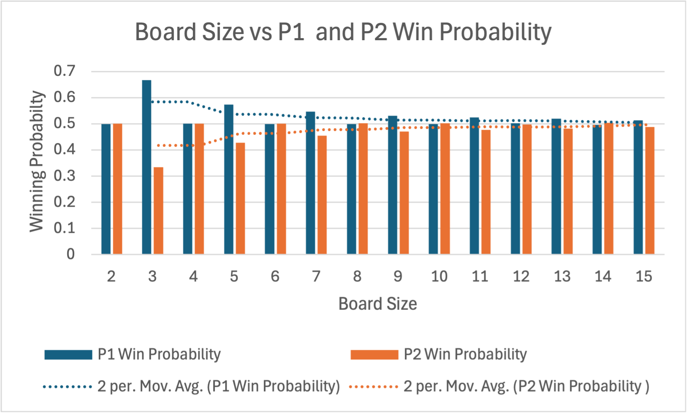
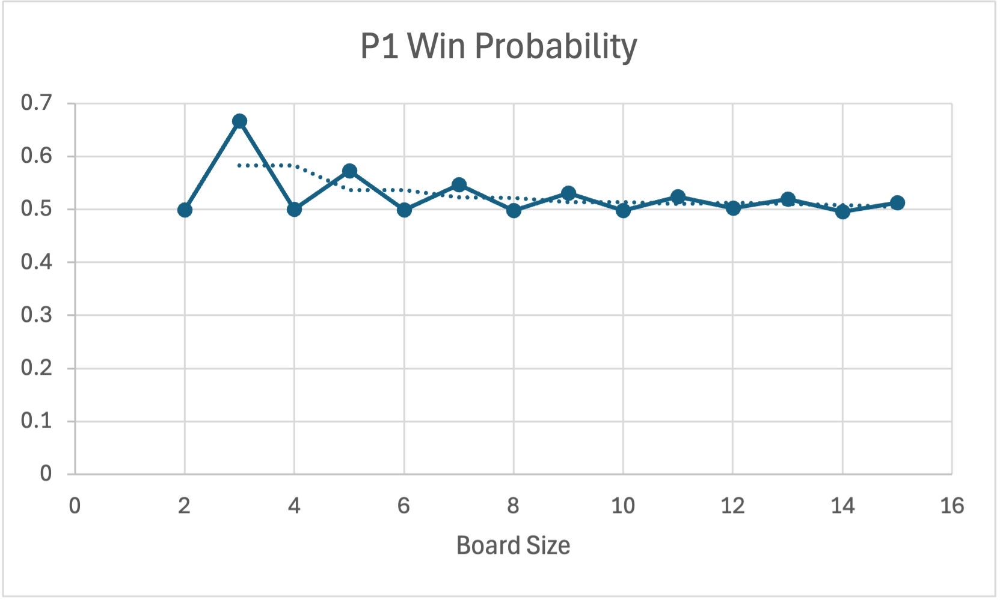

<meta charset="utf-8" lang="en">  <!-- this line allows UTF-8 characters in the .html file -->

                    **P01_Hex**

<!--

General
========

For each of your team's implementations, explain the following (where appropriate and applicable):

- details on calling conventions, input and output data formats, limitations, bugs, and special features.
- negative aspects of your program (limitations, known bugs)
- positive aspects (extensions, special features)
- describe your choice of modularization (abstractions), data structures, and algorithms
- explain anything you did that is likely to be different from what other students may have done
- justify any design decisions for which the rationale isn't immediately clear

Feel free to modify the structure of this `readme.html` file to fit the current assignment and to fit how you wish to present your findings.

Take a look at the [Markdeep Feature Demo](https://casual-effects.com/markdeep/features.md.html) to see how you can markup this document.

!!! note: Math Typesetting
    Surround your math with double dollar signs to have [MathJax](https://www.mathjax.org/) typeset it beautifully.
    To add a tilde in math mode (using dollar signs), use the `\sim` command.
    If an exponent has more than one character, you must surround it with curly braces.
    In the example below, the exponent for $T$ must use curly braces, but they aren't required for $N$.

    $$ \sim T^{1.2} N^2 $$

    Note: Typesetting like this is optional; feel free to use plain text if you'd like.

Submission
-----------

Use the CSE LogHistory Plug-in to create a zip file containing all your code, this `readme.html` document, and any additional files of evidence (ex: screenshots).
If you create a zip by other means, it will include all the files under `tests` and might miss some important files (ex: `.log/history.log`).
The former will make for a very large zip file; the latter will cause you to lose points.

-->

Author
=============
Matthew Saxby

<!-- fill out the following table with your information -->
<!-- Note: wrapping table in div.noheader will hide the table's header -->
<!-- Note: wrapping table in div.firstcol will style the first column different from other columns -->

                  |             
------------------|-------------
name              | Matthew Saxby
computer + OS     | M1 MacBook Air
time to complete  | 30 hours
partner           | Korban Miller
additional help   | Dr. Denning

Implementations
===================

<!--
Describe how you implemented `HexBoard.java`.
How did you check whether the game was won by a player?
-->

I implemented HexBoard Java by creating a board and giving every square an index.
When a player makes a move, it sets the tile and if it is touching another
hex of that same color, it creates a union between them. I created "virtual nodes"
that union the base of each side together. This allowed me to constantly
be checking if a player had connected their two ends of the board simply by always checking
if their virtual nodes were of the same union.

`QuickFindUF` Runtimes
----------------------

<!--
Report the runtimes of `HexBoard` using `QuickFindUF` in the tables below.
First, hold constant the value of $T$ (number of games played), but vary the value of $N$ (size of board).
Then, hold constant the value of $N$, but vary the value of $T$.

Finally, give a formula using tilde notation for the running time (seconds) of `HexBoardStats.java` as a
function of both $N$ (size of board) and $T$ (number of games).
Model the running time as a power law and be sure to give both the coefficient and exponent of the leading term.
Your coefficients should be based on _empirical data_ and rounded to two significant digits.
For example, $5.3 * 10^{-8} * N^{5.0} T^{1.5}$.
-->

Keeping T, or Games Played Constant:

Simulation | Games (T) | (N) Board Size (x^2) | Time (secs) | Ratio | Log Ratio
:---------:|:---------:|:--------------------:|:----------: |:-----:|:----------:
1|1000  |  2  |  0.039 seconds| 1 | n/a
2|1000  |  4  | 0.049 seconds | 1.256 | .33
3|1000  |  8  | 0.087 seconds | 1.776 | .829
4|1000  |  16  | 0.18 seconds | 2.069 | 1.04
5|1000  |  32  | 0.74 seconds | 4.11 | 2.039
6|1000  |  64  | 8.632 seconds | 11.66 | 3.54
7|1000  |  128  | 128.104 seconds | 14.8 | 3.888

Keeping N, or Board Size Constant:

 Simulation |(T) Games Played (x^2) |(N) Constant Board Size (5x5) | time (secs) | Ratio| Log(Ratio
|:---------:|:---------------------:|:----------------------------:|:----------: | :---:|:---------:
1 | 8192  |  5  | .072 seconds| 1| 0
2 | 16384  |  5  | .097 seconds| 1.347| .43
3 | 32768  |  5  | .145 seconds| 1.495| .58
4 | 65536  |  5  | .209 seconds| 1.441| .53
5 | 131072 |  5  | .349 seconds| 1.67| .74
6 | 262144  |  5  | .638 seconds| 1.82| .86
7 | 524288  |  5  | 1.171 seconds| 1.835| .876
8 | 1048576  |  5  | 2.184 seconds| 1.865| .9
9 | 2097152 |  5  | 4.251 seconds |1.947 | .961
10 | 4194304 |  5  | 8.316 seconds| 1.956 | .968

<!--
Place your runtime below.
Typeset your answer with double dollar signs: $$ \sim... $$
-->

Running time as a function of $N$ and $T$:

$$ \sim 3.243* 10^{-9} * N^{4} T^{1} $$

`WeightedQuickUnionUF` Runtimes
-------------------------------

<!--
Repeat the previous section, but use `WeightedQuickUnionUF`.
-->

Keeping T, or Games Played Constant:

Simulation | Games (T) | (N) Board Size (x^2) | Time (secs) | Ratio | Log Ratio
:---------:|:---------:|:--------------------:|:----------: |:-----:|:----------:
1|1000  |  2  |  0.043 seconds| 1 | n/a
2|1000  |  4  | 0.047 seconds | 1.093 | .128
3|1000  |  8  | 0.061 seconds | 1.298 | .376
4|1000  |  16  | 0.138 seconds | 2.262 | 1.178
5|1000  |  32  | 0.49 seconds | 3.55 | 1.828
6|1000  |  64  | 5.048 seconds | 10.3 | 3.364
7|1000  |  128  | 72.536 seconds | 14.37 | 3.845
8|1000  |  256  | 1072.865 seconds | 14.791 | 3.89

Keeping N, or Board Size Constant:

Simulation |(T) Games Played (x^2) |(N) Constant Board Size (5x5) | time (secs) | Ratio | Log Ratio
|:--------:|:---------------------:|:----------------------------:|:----------: | :---: |:---------:
1 | 8192  |  5  | .069 seconds| 1 | 0
2 | 16384  |  5  | .104 seconds| 1.51 | .59
3 | 32768  |  5  | .169 seconds| 1.625 | .7
4 | 65536  |  5  | .228 seconds| 1.35 | .43
5 | 131072 |  5  | .375 seconds| 1.645 | .71
6 | 262144  |  5  | .608 seconds| 1.621 | .697
7 | 524288  |  5  | 1.072 seconds| 1.763 | .818
8 | 1048576  |  5  | 2.044 seconds| 1.906 | .931
9 | 2097152  |  5  | 3.972 seconds| 1.943 | .958
10 | 4194304 |  5  | 7.7 seconds| 1.939 | .955

<!--
Place your runtime below.
Typeset your answer with double dollar signs: $$ \sim... $$
-->

Running time as a function of $N$ and $T$:

$$ \sim 2.702 * 10^{-10} * N^{4} T^{1} $$

Patterns and Winning Analysis
-----------------------------
These are the results from arguments `N0 = 2`, `N1 = 15`, and `T = 100000`.

 

<!--
Run `HexBoardStats` with `N0 = 2`, `N1 = 15`, and `T = 100000`.
What patterns do you see emerge from the probability estimates?
Add a table or chart if necessary.
-->

<!-- ... -->
-----------------------Board Size: 2-----------------------------

Total P1 Wins: 49935

P1 Win Probability: 0.49935

Total P2 Wins: 50066

P2 Win Probability: 0.50066

Draws: 0

Total Elapsed Time Calculating Board Size 2: 0.098 Seconds

-----------------------Board Size: 3-----------------------------

Total P1 Wins: 66661

P1 Win Probability: 0.66661

Total P2 Wins: 33340

P2 Win Probability: 0.3334

Draws: 0

Total Elapsed Time Calculating Board Size 3: 0.219 Seconds

-----------------------Board Size: 4-----------------------------

Total P1 Wins: 50003

P1 Win Probability: 0.50003

Total P2 Wins: 49998

P2 Win Probability: 0.49998

Draws: 0

Total Elapsed Time Calculating Board Size 4: 0.35 Seconds

-----------------------Board Size: 5-----------------------------

Total P1 Wins: 57300

P1 Win Probability: 0.573

Total P2 Wins: 42701

P2 Win Probability: 0.42701

Draws: 0
Total Elapsed Time Calculating Board Size 5: 0.561 Seconds

-----------------------Board Size: 6-----------------------------

Total P1 Wins: 49931

P1 Win Probability: 0.49931

Total P2 Wins: 50070

P2 Win Probability: 0.5007

Draws: 0

Total Elapsed Time Calculating Board Size 6: 0.871 Seconds

-----------------------Board Size: 7-----------------------------

Total P1 Wins: 54624

P1 Win Probability: 0.54624

Total P2 Wins: 45377

P2 Win Probability: 0.45377

Draws: 0

Total Elapsed Time Calculating Board Size 7: 1.301 Seconds

-----------------------Board Size: 8-----------------------------

Total P1 Wins: 49805

P1 Win Probability: 0.49805

Total P2 Wins: 50196

P2 Win Probability: 0.50196

Draws: 0

Total Elapsed Time Calculating Board Size 8: 1.909 Seconds

-----------------------Board Size: 9-----------------------------

Total P1 Wins: 53037

P1 Win Probability: 0.53037

Total P2 Wins: 46964

P2 Win Probability: 0.46964

Draws: 0

Total Elapsed Time Calculating Board Size 9: 2.735 Seconds

-----------------------Board Size: 10-----------------------------

Total P1 Wins: 49805

P1 Win Probability: 0.49805

Total P2 Wins: 50196

P2 Win Probability: 0.50196

Draws: 0

Total Elapsed Time Calculating Board Size 10: 3.834 Seconds

-----------------------Board Size: 11-----------------------------

Total P1 Wins: 52364

P1 Win Probability: 0.52364

Total P2 Wins: 47637

P2 Win Probability: 0.47637

Draws: 0

Total Elapsed Time Calculating Board Size 11: 5.261 Seconds

-----------------------Board Size: 12-----------------------------

Total P1 Wins: 50234

P1 Win Probability: 0.50234

Total P2 Wins: 49767

P2 Win Probability: 0.49767

Draws: 0

Total Elapsed Time Calculating Board Size 12: 7.089 Seconds

-----------------------Board Size: 13-----------------------------

Total P1 Wins: 51913

P1 Win Probability: 0.51913

Total P2 Wins: 48088

P2 Win Probability: 0.48088

Draws: 0

Total Elapsed Time Calculating Board Size 13: 9.392 Seconds

-----------------------Board Size: 14-----------------------------

Total P1 Wins: 49616

P1 Win Probability: 0.49616

Total P2 Wins: 50385

P2 Win Probability: 0.50385

Draws: 0

Total Elapsed Time Calculating Board Size 14: 12.227 Seconds

-----------------------Board Size: 15-----------------------------

Total P1 Wins: 51242

P1 Win Probability: 0.51242

Total P2 Wins: 48759

P2 Win Probability: 0.48759

Draws: 0

Total Elapsed Time Calculating Board Size 15: 15.695 Seconds

----------------Completed Simulation for 100,000 games on Board Sizes 2-15 ------------

Total Elapsed Time: 15.695 Seconds

Known bugs / limitations
-------------------------

<!--
What bugs or limitations were troublesome?
What bugs or limitations still remain?
Are these bugs or limitations a problem in your implementation, algorithm, or something else?
How do you know that you did not miss a bug?
What additional tests did you run to ensure that your implementations are correct?
-->
Bugs:
I had SO many bugs in this project. The first was that I had solved to check the surrounding tiles as if
the board was angled to the left and not to the right, so I could not for hours figure out what it would not correctly
address wins. The second bug I fought was that in my hexboard stats page, I could not figure out why it would not
correctly address if a player had won a game. Every single game that was simulated always came out as a tie. I solved
that I had been using hexboard.board[row][col] = player as opposed to the setTile function that we had created. Once I
implemented this, It worked super smooth. I also had initially tried to use a 2D array to store the moves, and it was
not working well at all, so it took me a while to create a 1D array to hold moves, which had bugs of its own, which I
fixed. I have debugged my code a few times, and run some bad arguments, and it throws errors, and works for the sizes
that it should. So I really hope that I did not miss any bugs.

Limitations:
My code is really bad at sharing water bottles with people (I could not solve the backwash issue). This being that the
shortest path is not highlighted as the winning path, but the entire path instead.

Reflection
===========

<!--
Describe whatever help (if any) that you received.
Don't include readings, lectures, but do include any help from people (including course staff, lab TAs, classmates, and friends) and attribute them by name.
How did you discuss the problem with others? (ex: white-board algorithms, looking over code for bugs, looking at print out results, etc.)
Describe any serious problems you encountered.
How much time did you spend writing new code, debugging code, thinking about the algorithms, discussing with someone else, running tests, writing comments and documentation, etc.?
List any other comments here.
Feel free to provide any feedback on how much you learned from doing the assignment, and whether you enjoyed doing it.
-->

This project taught me SO much. I learned about how to take the time to do something correctly the first time,
especially when it comes to the math behind these things. I tried to shortcut it, and it backfired and resulted in
me having to re-run my runtime analysis like 5 times. It took forever, and I will go slow next time. Korban helped me
a lot with my HexBoard file. I was really struggling to get it off the ground, and he specifically helped me
a lot with the check surrounding tiles functions. I also received help from Dr. Denning who reexplained how the
hexboard stats needed to be running, and how to make the log ratio calculations. Every serious problem I
encountered I wrote about in the bugs section. I kind of enjoyed doing this assignment, but I think that the
instructions were pretty ambiguous, and the calculations portion was pretty hard to figure out. But I do think I learned
a lot.

<!--   Feel free to modify the following to fit a theme of your choosing   -->
<link href="https://fonts.googleapis.com/css?family=Open+Sans&display=swap" rel="stylesheet"> <!-- a sans-serif font -->

<!-- ****************************** -->
<!--    Leave the content below     -->
<!-- ****************************** -->

<!-- The script and style below are added for clarity and to workaround a bug -->

<!--   Leave the following Markdeep formatting code, as this will format your text above to look nice in a wed browser   -->

